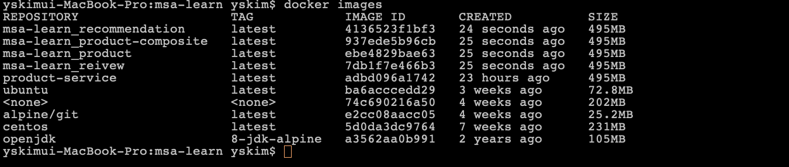

# Hands-On Microservices with Spring Boot And Spring Cloud

## Chapter 3

### gradle 설정

```bash
buildscript {
  ext {
    springBootVersion = '2.1.0.RC1'
  }

  repositories {
    mavenCentral ()
    maven { url "https://repo.spring.io/snapshot"}
    maven { url "https://repo.spring.io/milestone"}
  }
  dependencies {
    classpath("org.springframework.boot:spring-boot-gradle-plugin:${springBootVersion}")
  }
}

apply plugin: 'java'
apply plugin: 'eclipse'
apply plugin: 'org.springframework.boot'
apply plugin: 'io.spring.dependency-managerment'
```

- 스프링 부트 버전은 spring init 커맨드를 실행할 때 지정한 것으로 설정
- 스프링 프로젝트 저장소를 추가한 이유는 정식버전이 아닌 버전 (2.1.0.RC1)의 라이브러리는 중앙 메이븐 저장소에 없기 때문이다.

```bash
group = 'arthur.kim.microservices.core'
version = '0.0.1-SNAPSHOT'
sourceCompatibility = '11'

repositories {
  mavenCentral()
}

dependencies {
  implementation 'org.springframework.boot:spring-boot-starter-actuator'
  testImplementation 'org.springframework.boot:spring-boot-starter-test'
}

test {
  useJUnitPlatform()
}
```

### 플러그인

> 미리 구성해 놓은 task들의 그룹이며, 특정 빌드과정에서 필요한 기본정보를 포함하고, 필요에 따라 정보를 수정하여 목적에 맞게 사용할 수 있다.

- org.springframework.boot : 실행 가능한 jar또는 war아카이브를 패키징하고, Spring Boot 애플리케이션을 실행하고, spring-boot-dependencies에서 제공하는 종속성 관리를 사용할 수 있다.
- io.spring.dependency-management : 스프링버전에 따른 의존성을 자동으로 관리
- java : 실행가능한 jar를 빌딩하는 테스크가 자동적으로 설정

###  커맨드로 각 마이크로서비스 빌드

```bash
cd microservices/product-service; ./gradlew build; cd -; \
cd microservices/product-composite-service; ./gradlew build; cd -; \
cd microservices/recommendation-service; ./gradlew build; cd-; \
cd microservices/review-service; ./gradlew build; cd-;
```

## 그래들에 멀티 프로젝트 빌드 설정

### 1. settings.gradle 파일을 생성하고 그래들이 빌드할 프로젝트를 입력

```gradle
include ':microservices:product-service'
include ':microservices:review-service'
include ':microservices:recommendation-service'
include ':microservices:product-composite-service'
```

### 2. Product-service 프로젝트에서 그래들 실행 파일을 복사

```bash
# cp: copy
cp -r microservices/product-service/gradle .; \
cp -r microservices/product-service/gradlew .; \
cp -r microservices/product-service/gradlew.bat .; \
cp -r microservices/product-service/.gitignore .; \
```

### 3. 각 프로젝트의 그래들 실행 파일 제거

```bash
# "{}" > find 로 찾은 파일명

# -r : recursive
# -f : force
# -v : verbose

find microservices -depth -name "gradle" -exec rm -rfv "{}" \;
find microservices -depth -name "gradlew" -exec rm -fv "{}" \;
```

### 4. 하나의 커맨드로 전체 마이크로서비스 빌드

```bash
./gradlew build
```

### 5. 마이크로 서비스 런

```bash
java -jar microservices/product-service/build/libs/product-service-0.0.1-SNAPSHOT.jar &

java -jar microservices/product-composite-service/build/libs/product-composite-service-0.0.1-SNAPSHOT.jar &


java -jar microservices/review-service/build/libs/review-service-0.0.1-SNAPSHOT.jar &

java -jar microservices/recommendation-service/build/libs/recommendation-service-0.0.1-SNAPSHOT.jar &


```

### api, util프로젝트는 각 프로젝트에서 빌드가 안되서 ide가 의미없음

### Gradle은 각 환경별 세팅을 맞추고 싶다면, gradle wrapper를 이용하면 좋다

### 포트 죽이기

```bash
kill $(jobs -p )
```

### @RestControllerAdvice 를 이용해서 예외처리하기

> @ExceptionHandler, @ModelAttribute, @InitBinder 가 적용된 메서드들을 AOP를 적용해 컨트롤러 단에 적용하기 위해 고안된 애너테이션

```java
@RestControllerAdvice
public class GlobalControllerExceptionHandler {
  private static final Logger LOG = LoggerFactory.getLogger(GlobalControllerExceptionHandler.class);

  @ResponseStatus(NOT_FOUND)
  @ExceptionHandler(NotFoundException.class)
  public @ResponseBody HttpErrorInfo handleNotFoundExceptions(ServerHttpRequest request, Exception ex) {
    return createHttpErrorInfo(NOT_FOUND, request, ex);
  }

  @ResponseStatus(UNPROCESSABLE_ENTITY)
  @ExceptionHandler(InvalidInputException.class)
  public @ResponseBody HttpErrorInfo handelInvalidInputException(ServerHttpRequest request, Exception ex) {

    return createHttpErrorInfo(UNPROCESSABLE_ENTITY, request, ex);
  }

  private HttpErrorInfo createHttpErrorInfo(HttpStatus httpStatus, ServerHttpRequest request, Exception ex) {
    final String path = request.getPath().pathWithinApplication().value();
    final String message = ex.getMessage();

    LOG.debug("Returning HTTP status: {} for path: {}, message: {}", httpStatus, path, message);
    return new HttpErrorInfo(httpStatus, path, message);
  }

}

```

### @ExceptionHandler

> @Controller, @RestController가 적용된 Bean내에서 발생하는 예외를 잡아서 하나의 메서드에서 처리

1. Controller, RestController에만 적용가능하다. (@Service같은 빈에서는 안됨.)
2. 리턴 타입은 자유롭게 해도 된다. (Controller내부에 있는 메서드들은 여러 타입의 response를 할 것이다. 해당 타입과 전혀다른 리턴 타입이어도 상관없다.)
3. @ExceptionHandler를 등록한 Controller에만 적용된다. 다른 Controller에서 NullPointerException이 발생하더라도 예외를 처리할 수 없다.
4. 메서드의 파라미터로 Exception을 받아왔는데 이것 또한 자유롭게 받아와도 된다.

### 테스트 목록

```bash
# 존재하지 않는 productId(13)를 조회하고 404(Not Found)가 반환되는지 검증
curl http://localhost:7000/product-composite/13 -i
```

### webflux 와 함께나온 WebTestClient는 요청을 보내고 결과를 검증하는 다양한 API를 제공한다

### Testcase 에서 안되는 점들

#### junit 5에서는 @RunWith(SpringRunner.class) 를 사용하지 않는다

#### junit 5에서는 @Before 대신 @BeforeAll 또는 @BeforeEach

#### WebEnvironment.RANDOM_PORT 는 restTemplate을 테스트하기 위함. ( Default는 WebEnvironment.MOCK )

#### Test 검증에 실패한 케이스의 경우 build시 오류로 출력된다. ( + 빌드 실패 )

```bash
> Task :microservices:product-composite-service:test

ProductCompositeServiceApplicationTests > getProductId() FAILED
    java.lang.AssertionError: JSON path "$.recommendations.length()" expected:<0> but was:<1>
        at org.springframework.test.util.AssertionErrors.fail(AssertionErrors.java:59)
        at org.springframework.test.util.AssertionErrors.assertEquals(AssertionErrors.java:122)
        at org.springframework.test.util.JsonPathExpectationsHelper.assertValue(JsonPathExpectationsHelper.java:125)
        at org.springframework.test.web.reactive.server.JsonPathAssertions.isEqualTo(JsonPathAssertions.java:54)
        at arthur.kim.microservices.core.product.composite.ProductCompositeServiceApplicationTests.getProductId(ProductCompositeServiceApplicationTests.java:57)

4 tests completed, 1 failed
Finished generating test XML results (0.025 secs) into: /Users/yskim/Desktop/msa-learn/microservices/product-composite-service/build/test-results/test
Generating HTML test report...
Finished generating test html results (0.021 secs) into: /Users/yskim/Desktop/msa-learn/microservices/product-composite-service/build/reports/tests/test

> Task :microservices:product-composite-service:test FAILED
:microservices:product-composite-service:test (Thread[Execution worker for ':' Thread 7,5,main]) completed. Took 12.034 secs.

FAILURE: Build failed with an exception.
```

- Test Result Dashboard

> file:///Users/yskim/Desktop/msa-learn/microservices/product-composite-service/build/reports/tests/test/index.html

####  책에 나온 @ExceptionHandler 는 거의 동작하지 않는다. 아래와 같이 수정해서 테스트 하였다

- GlobalControllerExceptionHandler.java

```java
@RestControllerAdvice
public class GlobalControllerExceptionHandler {
 private static final Logger LOG = LoggerFactory.getLogger(GlobalControllerExceptionHandler.class);

 @ExceptionHandler(NotFoundException.class)
 @ResponseBody
 public ResponseEntity<?> handleNotFoundException(Exception ex) {
  return new ResponseEntity<>(ex, HttpStatus.NOT_FOUND);
 }

 @ExceptionHandler(InvalidInputException.class)
 @ResponseBody
 public ResponseEntity<?> handleInvalidInputException(Exception ex) {
  return new ResponseEntity<>(ex, HttpStatus.UNPROCESSABLE_ENTITY);
 }

}

```

- ProductCompositeServiceApplicationTests.java

```java
    @Test
    public void getProductNotFound() {
     client.get()
      .uri("/product-composite/" + PRODUCT_ID_NOT_FOUND)
      .accept(MediaType.APPLICATION_JSON)
      .exchange()
      .expectStatus().isNotFound()
      .expectHeader().contentType(MediaType.APPLICATION_JSON)
      .expectBody()
      .jsonPath("$.message").isEqualTo("NOT FOUND: " + PRODUCT_ID_NOT_FOUND);
    }

    @Test
    public void getProductInvalidInput() {
     client.get()
      .uri("/product-composite/" + PRODUCT_ID_INVALID)
      .accept(MediaType.APPLICATION_JSON)
      .exchange()
      .expectStatus().isEqualTo(HttpStatus.UNPROCESSABLE_ENTITY)
      .expectHeader().contentType(MediaType.APPLICATION_JSON)
      .expectBody()
      .jsonPath("$.message").isEqualTo("INVALID: " + PRODUCT_ID_INVALID);
    }
```

### bash script로 통합 테스트 하기

#### assertCurl()

```bash
function assertCurl() {

  local expectedHttpCode=$1
  local curlCmd="$2 -w\"%{http_code}\""
  local result=$(eval $curlCmd)
  local httpCode="${result:(-3)}"
  RESPONSE='' && (( ${#result} > 3 )) && RESPONSE="${result%???}"

  if [ "$httpCode" = "$expectedHttpCode" ]
  then
    if [ "$httpCode" = "200" ]
    then
      echo "Test OK (HTTP Code: $httpCode)"
    else
      echo "Test OK (HTTP Code: $httpCode, $RESPONSE)"
    fi
  else
      echo "Test FAILED, EXPECTED HTTP Code: $expectedHttpCode, GOT: $httpCode, WILL ABORT!"
      echo "- Failing command: $curlCmd"
      echo "- Response Body: $RESPONSE"
      exit 1
  fi
}
```

#### assertEqual()

```bash
function assertEqual() {

  local expected=$1
  local actual=$2

  if [ "$actual" = "$expected" ]
  then
    echo "Test OK (actual value: $actual)"
  else
    echo "Test FAILED, EXPECTED VALUE: $expected, ACTUAL VALUE: $actual, WILL ABORT"
    exit 1
  fi
}
```

#### curl | -w 옵션

> -w, --write-out FORMAT <format>

- 응답에서 포맷에 맞는 데이터를 출력할 수 있다.
- %{variable_name} 과 같은 식으로 출력할 수 있다.
- content_type, http_code, time_total 등의 정보를 출력할 수 있다.

#### curl | -s 옵션

> -s, --silent

- 프로그레스나 에러 정보를 보여주지 않는다.

#### local

> 선언된 변수는 기본적으로 전역 변수(global variable)다. 단 함수 안에서만 지역 변수(local variable)를 사용할 수 있는데 사용할려면 변수 명 앞에 local을 붙여주면 된다.

#### ${#변수}

> 문자열 길이(예: echo ${#string})

#### ${변수%단어}

> 변수의 뒷부분부터 짧게 일치한 단어 삭제(예: echo ${string%b\*c})

```bash
string="abc-efg-123-abc"
echo ${string%b*c} # abc-efg-123-a
echo ${string%???} # abc-efg-123-
```

#### ./bash-test.bash: Permission denied

```bash
chmod u+x ./bash-test.bash
# u stands for user.
# g stands for group.
# o stands for others.
# a stands for all. ( default )
# chmod +x {filename} | you'll make it executable.
```

#### curl | 결과값

> curl <http://localhost:7000/product-composite/1> -s -w "%{http_code}"

```json
{
  "productId": 1,
  "name": "name-1",
  "weight": 123,
  "recommendations": [
    {
      "recommendationId": 1,
      "author": "Author 1",
      "rate": 1
    },
    {
      "recommendationId": 2,
      "author": "Author 2",
      "rate": 2
    },
    {
      "recommendationId": 3,
      "author": "Author 3",
      "rate": 3
    }
  ],
  "reviews": [
    {
      "reviewId": 1,
      "author": "Author 1",
      "subject": "Subject 1"
    },
    {
      "reviewId": 2,
      "author": "Author 2",
      "subject": "Subject 2"
    },
    {
      "reviewId": 3,
      "author": "Author 3",
      "subject": "Subject 3"
    }
  ],
  "serviceAddresses": {
    "cmp": "yskimui-MacBook-Pro.local/218.38.137.27:7000",
    "pro": "yskimui-MacBook-Pro.local/218.38.137.27:7001",
    "rev": "yskimui-MacBook-Pro.local/218.38.137.27:7003",
    "rec": "yskimui-MacBook-Pro.local/218.38.137.27:7002"
  }
}
200
```

## Chapter 4

### 첫 도커 명령 실행

```bash
docker run -it --rm ubuntu
```

#### -it

- 터미널을 통해 컨테이너와 상호작용

#### --rm

- 테미널 세션을 마치면 종료하도록 설정

### 컨테이너 모두 제거

```bash
docker rm -f $(docker ps -aq)
```

#### -a

- 실행 중 이거나, 중지된 컨테이너의 ID를 출력

#### -q

- 커맨드의 출력을 정리하고 컨테이너 ID만 남긴다.

### 도커에서 자바를 실행할 때의 문제

- 9 버전 이하의 자바에서는 리눅스 cgroup으로 지정한 자원 할당량을 무시했었음

### 도커 이미지 빌드

#### jar으로 프로젝트 빌드

```bash
./gradlew :microservices/product-service/build
```

#### Dockerfile을 이용해 도커 이미지 빌드

```Dockerfile
FROM openjdk:12.0.2

EXPOSE 8080

ADD ./build/libs/*.jar app.jar

ENTRYPOINT ["java","-jar","/app.jar"]
```

```bash
docker build -t product-service .

# 확인
docker images | grep product-service
```

#### -t ( TAG 이름 )

#### 도커 이미지 실행

```bash
docker run --rm -p 8080:8080 -e "SPRING_PROFILE_ACTIVE=docker" product-service
```

#### 실행 확인

```bash
curl localhost:8080/product/3 | jq
```

#### 데몬모드로 실행하기

```bash
docker run -d -p 8080:8080 -e "SPRING_PROFILES_ACTIVE=docker" --name my-prd-svc product-service
```

- 로그 보기

```bash
docker logs my-prd-srv -f
```

### docker-compose.yml

#### 마이크로서비스의 이름 => 도커 내부 네크워크에서 사용하는 컨테이너의 호스트 이름

#### build : Dockerfile의 위치를 지정하는 빌드 지시문

#### mem_limit : 메모리는 350MB로 제한, 이래야 총 6GB로 맞출 수 있음

#### environment : 환경변수, 스프링 프로필 지정하기 위함

```yml
version: "2.1"

services:
  product:
    build: microservices/product-service
    mem_limit: 350m
    environment:
      - SPRING_PROFILES_ACTIVE=docker

  recommendation:
    build: microservices/recommendation-service
    mem_limit: 350m
    environment:
      - SPRING_PROFILES_ACTIVE=docker

  reivew:
    build: microservices/reivew-service
    mem_limit: 350m
    environment:
      - SPRING_PROFILES_ACTIVE=docker

  product-composite:
    build: microservices/product-composite-service
    mem_limit: 350m
    ports:
      - "8080:8080"
    environment:
      - SPRING_PROFILES_ACTIVE=docker
```

### 마이크로서비스 환경 시작

#### 이미지 빌드

```bash
./gradlew build
docker-compose build
```


#### 이미지 확인

```bash
docker images
```



#### 도커 실행

```bash
docker-compose up -d
```

#### 모니터링

```bash
docker-compose logs -f
```


#### 테스트

```bash
curl localhost:8080/product-composite/123 -s | jq .
```


#### 종료

```bash
docker-compose down
```

### bash script를 이용한 마이크로 서비스 환경테스트

#### testUrl

```bash
function testUrl() {
  url=$@
  if curl $url -ks -f -o /dev/null
  then
    echo "Ok"
    return 0
  else
    echo -n "not yet"
    return 1
  fi;
}
```

#### waitForService

```bash
function waitForService() {
  url=$@
  echo -n "Wait for: $url..."
  n=0
  until testUrl $url
  do
    n=$((n + 1))
    if [[ $n == 100 ]]
    then
      echo " Give up "
      exit 1
    else
      sleep 6
      echo -n ", retry #$n "
    fi
  done
}
```

## Chapter 5 | OpenAPI / 스웨거를 사용한 API 문서화

### 목표 : product-composite-service 노출하는 공개 API에 스퀘거 기반 문서추가

### 의존성 추가

- springfox-swagger2 : 스웨거 2 기반의 문서 생성
- springfox-spring-webflux : 스프링 웹플럭스 기반의 RESTful 오퍼레이션 지원
- springfox-swagger-ui : 마이크로서비스에 스웨거 뷰어를 내장

```gradle
<!-- product-composite-service -->
implementation "io.springfox:springfox-boot-starter:3.0.0"
```

```gradle
<!-- api -->
implementation "io.springfox:springfox-boot-starter:3.0.0"
```

### SpringFoxConfig

```java
@Value("${api.common.version}")
 String apiVersion;
 @Value("${api.common.title}")
 String apiTitle;
 @Value("${api.common.description}")
 String apiDescription;
 @Value("${api.common.termsOfServiceUrl}")
 String apiTermsOfServiceUrl;
 @Value("${api.common.license}")
 String apiLicense;
 @Value("${api.common.licenseUrl}")
 String apiLicenseUrl;
 @Value("${api.common.contact.name}")
 String apiContactName;
 @Value("${api.common.contact.url}")
 String apiContactUrl;
 @Value("${api.common.contact.email}")
 String apiContactEmail;

 @Bean
 public Docket apiDocumentation() {
  return new Docket(DocumentationType.SWAGGER_2)
    .select()
    .apis(RequestHandlerSelectors.any())
    .paths(PathSelectors.any()).build()
    .apiInfo(new ApiInfo(apiTitle, apiDescription, apiVersion, apiTermsOfServiceUrl,
      new Contact(apiContactName, apiContactUrl, apiContactEmail), apiLicense, apiLicenseUrl,
      emptyList()));
 }
```

- 스웨거 V2 문서를 생성하고자 Docket 빈을 초기화한다.
- apis(), paths() 메서드로 스프링 폭스가 API 정보를 찾을 위치를 지정

### Docket

- API 문서는 버전관리가 되어야 하므로, Docket Bean 단위로 버전관리를 작성

#### select()

- ApiSelectorBuilder를 생성

#### apis()

- api 스펙이 작성되어 있는 패키지 지정

#### paths()

- apis()로 선택되어진 API중에서 특정 path 조건에 맞는 API들을 다시 필터링 하여 문서화

#### apiInfo()

- 제목, 설명 등 문서에 대한 정보들을 보여주기 위해 호출

```java
public ApiInfo( title, description, version, termsOfServiceUrl, contact, license, licenseUrl, vendorExtensions )
```

### 문서 작성

```java
@Api(description = "REST API for composite product information")
public interface ProductCompositeService {

 /**
  * Sample usage: curl $HOST:$PORT/product-composite/1
  *
  * @param productId
  * @return the composite product info, if found, else null
  */
 @ApiOperation(value = "${api.product-composite.get-composite-product.description}", notes = "${api.product-composite.get-composite-product.notes}")
 @ApiResponses(value = {
   @ApiResponse(code = 400, message = "Bad Request, invalid format of the request. See response message for more information."),
   @ApiResponse(code = 404, message = "Not found, the specified id does not exist."),
   @ApiResponse(code = 422, message = "Unprocessable entity, input parameters caused the processing to fails. See response message for more information.") })
 @GetMapping(value = "/product-composite/{productId}", produces = "application/json")
 ProductAggregate getProduct(@PathVariable int productId);
}

```

### 명세서 ( application.yml )

```yml
api:
  common:
    version: 1.0.0
    title: Sample API
    description: Description of the API...
    termsOfServiceUrl: MINE TERMS OF SERVICE URL
    license: License
    licenseUrl: MY LICENSE URL

    contact:
      name: Contact
      url: My
      email: me@mail.com

  product-composite:
    get-composite-product:
      description: Returns a composite view of the specified product id
      notes: |
        # Normal response
        If the requested product id is found the method will return information regarding:
        1. Base product information
        2. Reviews
        3. Recommendations
        4. Service Addresses\n(technical information regarding the addresses of the microservices that created the response)

        # Expected partial and error responses
        In the following cases, only a partial response be created (used to simplify testing of error conditions)

        ## Product id 113
        200 - Ok, but no recommendations will be returned

        ## Product id 213
        200 - Ok, but no reviews will be returned

        ## Non numerical product id
        400 - A <b>Bad Request</b> error will be returned

        ## Product id 13
        404 - A <b>Not Found</b> error will be returned

        ## Negative product ids
        422 - An <b>Unprocessable Entity</b> error will be returned
```

### swagger-ui 이슈

> 스프링 - 2.3.x, swagger - 3.0.0 버전에서는 페이지가 안뜨는 이슈가 있다.

<https://stackoverflow.com/questions/48311447/springboot-swagger-url-shows-whitelabel-error-page>

### swagger-ui 접속

> <http://localhost:8080/swagger-ui/index.html>


## Chapter 6 | 영속성 추가

### 의존성 추가 (mapStruct, spring-boot-starter-data-mongodb)

#### mapStruct

> a code generator that greatly simplifies the implementation of mappings between Java bean types based on a convention over configuration approach.

```groovy
ext {
 mapstructVersion = "1.3.1.Final"
}

dependencies {
  ...
   // mapstruct
    implementation "org.mapstruct:mapstruct:${mapstructVersion}"
    annotationProcessor "org.mapstruct:mapstruct-processor:${mapstructVersion}"

    testAnnotationProcessor "org.mapstruct:mapstruct-processor:${mapstructVersion}" // if you are using mapstruct in test code
}
```

> 역시 책에 있는대로 따라하면 동작하지 않는다. ( gradle 7버전 이후 compile, compileOnly 옵션 deprecated )

#### spring-boot-starter-data-mongodb

```groovy
dependencies {
  ...
    // mongoDB
    implementation 'org.springframework.boot:spring-boot-starter-data-mongodb'
    testImplementation 'de.flapdoodle.embed:de.flapdoodle.embed.mongo'
}
```

### Entity

#### mongodb

##### @Document(collection="products")

> 이 클래스가 MongoDB 엔티티 클래스이며, products라는 이름의 MongoDB 컬렉션에 매핑된다는 것을 표시한다.

##### @Id 및 @Version

> 스프링 데이터의 id 및 version 필드라는 것을 표시한다.

##### @Indexed(unique = true)

> 비즈니스 키, productId에 생성된 고유색인을 가져온다.

##### @CompoundIndex(name = "prod-rec-id", unique = true, def = "{'productId': 1, 'recommendationId': 1}")

> productId와 recommendationId 필드로 구성된 복합 비즈니스 키를 위한 고유 복합 인덱스를 생성

#### JPA 엔티티 ( javax )

##### @Entity 및 @Table

> 이 클래스가 JPA 엔티티 클래스이며, SQL 데이터베이스의 products 테이블에 매핑된다는 것을 표시한다.

##### @Table(name = "reviews", indexes = { @Index(name = "reviews_unique_idx", unique = true, columnList = "productId,reviewId") })

> productId와 reviewId 필드로 구성된 복합 비즈니스 키를 위한 고유 복합 인덱스를 생성하는 역할도 한다.

##### JPA | @Id 및 @Version

> 스프링 데이터의 id 및 version 필드라는 것을 표시한다.

##### @GeneratedValue

> 스프링 데이터 JPA가 id 필드에 고유한 id 값을 자동으로 생성하도록 지시한다.

### Repository

#### CrudRepository

```java
public interface ReviewRepository extends CrudRepository<ReviewEntity, Integer>{
 @Transactional(readOnly = true) // 읽기전용이므로 영속성 컨택스트는 스냅샷을 보관하지 않는다. => 메모리 사용량을 최적화 시킬 수 있다.
 List<ReviewEntity> findByProductId(int productId);

}
```

#### PagingAndSortingRepository

```java
public interface ProductRepository extends PagingAndSortingRepository<ProductEntity, String>{
  Optional<ProductEntity> findByProductId(int productId);
}
```

### JPA

#### query-method

<https://docs.spring.io/spring-data/data-commons/docs/current/reference/html/#repositories.query-methods.query-creation>

### 영속성 테스트

#### @DataMongoTest

> 테스트를 시작할 때 내장형 MongoDB 데이터베이스를 시작한다.

#### @DataJpaTest

> 테스트를 시작할 때 내장형 SQL 데이터베이스를 시작한다.\
> 스프링 부트는 다른 테스트에 의한 부작용을 최소화하고자 SQL 데이터베이스에 업데이트한 내용을 롤백하도록 테스트를 구성한다.\
> 이런 이유로 일부 테스트가 실패하기 때문에 클래스 수준 어노테이션 @Transactional(propagation = NOT_SUPPORT)을 사용해 자동 롤백을 비활성화 한다.

#### 테스트 실행

```bash
./gradlew microservices:product-service:test --tests PersistenceTests
```


#### 테스트 설정 ( junit5 | jupiter )

```java
@DataMongoTest
//@TestInstance(Lifecycle.PER_CLASS)  // BeforeAll 을 static이 아닌 함수로 사용시
public class PersistenceTests {

 @Autowired
 private ProductRepository repository;

 private ProductEntity savedEntity;

  @BeforeEach
 public void setupDb() {
  repository.deleteAll();

  ProductEntity entity = new ProductEntity(1, "n", 1);
  savedEntity = repository.save(entity);

  assertEqualsProduct(entity, savedEntity);
 }
}
```

#### create 테스트

```java
@Test
 public void create() {
  ProductEntity newEntity = new ProductEntity(2, "n", 2);
  savedEntity = repository.save(newEntity);

  ProductEntity foundEntity = repository.findById(newEntity.getId()).get();
  assertEqualsProduct(newEntity, foundEntity);

  assertEquals(2, repository.count());
 }
```

#### update 테스트

```java
@Test
 public void update() {
  savedEntity.setName("n2");
  repository.save(savedEntity);

  ProductEntity foundEntity = repository.findById(savedEntity.getId()).get();

  assertEquals(1, (long)foundEntity.getVersion());
  assertEquals("n2", foundEntity.getName());
 }
```

#### delete 테스트

```java
@Test
 public void delete() {
  repository.delete(savedEntity);
  assertFalse(repository.existsById(savedEntity.getId()));
 }
```

#### getByProductId 테스트

```java
@Test
 public void getByProductId() {
  Optional<ProductEntity> entity = repository.findByProductId(savedEntity.getProductId());
  assertTrue(entity.isPresent());
  assertEqualsProduct(savedEntity, entity.get());
 }
```

#### 중복테스트

```java
// import org.springframework.dao.DuplicateKeyException;

@Test
  public void duplicateError() {
    assertThrows(DuplicateKeyException.class, () -> {
      ProductEntity entity2 = new ProductEntity(savedEntity.getProductId(), "n", 1);
      repository.save(entity2);
    });
  }
```

##### 중복 에러가 나타나지 않는 현상

<https://stackoverflow.com/questions/66736109/spring-data-for-mongo-db-does-not-throw-duplicatekeyexception>

```yml
# application.yml
spring.data.mongodb:
  host: localhost
  port: 27017
  database: product-db
  auto-index-creation: true
```

#### 낙관적 잠금 메커니즘 테스트

```java
@Test
 public void optimisticLockError() {

  // 데이터베이스에서 가져온 엔티티를 변수 2개에 저장한다.
  ProductEntity entity1 = repository.findById(savedEntity.getId()).get();
  ProductEntity entity2 = repository.findById(savedEntity.getId()).get();

  // 첫 번째 엔티티 객체를 업데이트 한다.
  entity1.setName("n1");
  repository.save(entity1);

  // 두 번째 엔티티 객체를 업데이트한다.
  // 두 번째 엔티티 객체의 버전이 낮으므로 실패한다.
  // 즉 낙관적 잠금 오류가 발생해 실패한다.
  try {
   entity2.setName("n2");
   repository.save(entity2);

   fail("Expected an OptimisticLockingFailureException");
  } catch (OptimisticLockingFailureException e) {}

  // 데이터베이스에서 업데이트된 엔티티를 가져와서 새로운 값을 확인한다.
  ProductEntity updatedEntity = repository.findById(savedEntity.getId()).get();
  assertEquals(1, (int)updatedEntity.getVersion());
  assertEquals("n1", updatedEntity.getName());
 }
```

#### paging 테스트

```java
@Test
 public void paging() {
  repository.deleteAll();
  List<ProductEntity> newProducts = rangeClosed(1001, 1010)
    .mapToObj(i -> new ProductEntity(i, "name " + i, i)).collect(Collectors.toList());
  repository.saveAll(newProducts);

  PageRequest nextPage = PageRequest.of(0, 4, Direction.ASC, "productId");
  Page<ProductEntity> productPage = repository.findAll(nextPage);
  assertEquals("[1001, 1002, 1003, 1004]", productPage.getContent().stream().map(p -> p.getProductId()).collect(Collectors.toList()).toString());
  assertEquals(true, productPage.hasNext());
//  nextPage = testNextPage(nextPage, "[1001, 1002, 1003, 1004]", true);
//  nextPage = testNextPage(nextPage, "[1005, 1006, 1007, 1008]", true);
//  nextPage = testNextPage(nextPage, "[1009, 1010]", false);

 }
```


### API

#### create

```java
@PostMapping(
  value = "/product",
  consumes = "application/json",
  produces = "application/json"
)
Product createProduct(@RequestBody Product body);
```

#### delete

```java
@DeleteMapping(
  value = "/product/{productId}"
)
void deleteProduct(@PathVariable int productId);
```

### Mapper (Entity <-> Api)

```java
@Mapper(componentModel = "spring")
public interface RecommendationMapper {

 @Mappings({
  @Mapping(target = "rate", source="entity.rating"),
  @Mapping(target = "serviceAddress", ignore = true)
 })
 Recommendation entityToApi(RecommendationEntity entity);

 @Mappings({
  @Mapping(target = "rating", source="api.rate"),
  @Mapping(target = "id", ignore = true),
  @Mapping(target = "version", ignore = true)
 })
 RecommendationEntity apiToEntity(Recommendation api);

 List<Recommendation> entityListToApiList(List<RecommendationEntity> entity);
 List<RecommendationEntity> apiListToEntityList(List<Recommendation> api);
}
```

#### entityToApi

> 엔티티 객체를 API 모델 객체에 매핑\
> 엔티티 클래스에는 serviceAddress가 없으므로 무시가능하도록 ignore = true\
> 엔티티의 rating 필드와 API 모델의 rate 필드 매핑

#### apiToEntity

> API 모델 객체를 엔티티 객체에 매칭 \
> API 모델 클래스에는 id, version이 없으므로 ignore = true \
> 엔티티의 rating 필드와 API 모델의 rate 필드 매핑

- mapstruct 1.3.1.Final 버전에서 알수없는 버그에 헤매다 1.4.0.Beta3 로 바꾸니 해결되었다.

```bash
> Task :microservices:review-service:compileJava FAILED
/Users/yskim/Desktop/msa-learn/microservices/review-service/src/main/java/arthur/kim/microservices/core/review/services/ReviewMapper.java:24: error: arthur.kim.microservices.core.review.persistence.ReviewEntity does not have an accessible parameterless constructor.
        ReviewEntity apiToEntity(Review api);
                     ^
1 error
```

##### Vscode | The import of \*\* cannot be resolved 에러

> cmd + shift + P \
> Java: Clean Java Language Server Workspace

##### No qualifying bean of type 'org.springframework.boot.web.reactive.context.ReactiveWebApplicationContext' available

> @SpringBootTest(webEnvironment = SpringBootTest.WebEnvironment.RANDOM_PORT)

#### Spring Mongodb 에서 CompoundIndex의 unique 옵션이 먹히지 않을 때

```yml
# application.yml

spring:
  data:
    mongodb:
      auto-index-creation: true
```

#### DuplicationException 이 안잡힐 때

> import com.mongodb.DuplicateKeyException;

대신에

> import org.springframework.dao.DuplicateKeyException;

를 사용한다.

#### handleHttpClientException

```java
private RuntimeException handleHttpClientException(HttpClientErrorException ex) {
  switch (ex.getStatusCode()) {

    case NOT_FOUND:
      return new NotFoundException(getErrorMessage(ex));

    case UNPROCESSABLE_ENTITY:
      return new InvalidInputException(getErrorMessage(ex));

    default:
      LOG.warn("Got a unexpected HTTP error: {}, will rethrow it", ex.getStatusCode());
      LOG.warn("Error body: {}", ex.getResponseBodyAsString());
      return ex;
  }
}
```

#### 통합 계층에 메서드 추가

```java
// ProductCompositeIntegration.java
  @Override
  public Product createProduct(Product body) {
    try {
      return restTemplate.postForObject(productServiceUrl, body, Product.class);
    } catch (HttpClientErrorException ex) {
      throw handleHttpClientException(ex);
    }
  }

  @Override
  public void deleteProduct(int productId) {
    try {
      restTemplate.delete(productServiceUrl + "/" + productId);
    } catch (HttpClientErrorException ex) {
      throw handleHttpClientException(ex);
    }
  }
```

#### Integration API 구성

```java
// api/src/../ProductCompositeService.java
@Api(description = "REST API for composite product information")
public interface ProductCompositeService {

  /**
   * Sample usage: curl $HOST:$PORT/product-composite/1
   *
   * @param productId
   * @return the composite product info, if found, else null
   */
  @ApiOperation(value = "${api.product-composite.get-composite-product.description}", notes = "${api.product-composite.get-composite-product.notes}")
  @ApiResponses(value = {
      @ApiResponse(code = 400, message = "Bad Request, invalid format of the request. See response message for more information."),
      @ApiResponse(code = 404, message = "Not found, the specified id does not exist."),
      @ApiResponse(code = 422, message = "Unprocessable entity, input parameters caused the processing to fails. See response message for more information.") })
  @GetMapping(value = "/product-composite/{productId}", produces = "application/json")
  ProductAggregate getCompositeProduct(@PathVariable int productId);

  /**
   * Sample usage:
   *
   * curl -X POST $HOST:$PORT/product-composite \
   * -H "Content-Type: application/json" --data \
   * '{"productId":123,"name":"product 123","weight":123}'
   *
   * @param body
   */
  @ApiOperation(value = "${api.product-composite.create-composite-product.description", notes = "${api.product-composite.create-composite-product.notes}")
  @ApiResponses(value = {
      @ApiResponse(code = 400, message = "Bad Request, invalid format of the request. See response message for more information."),
      @ApiResponse(code = 422, message = "Unprocessable entity, input parameters caused the processing to fail. See response message for more information.")
  })
  @PostMapping(value = "/product-composite", consumes = "application/json")
  void createCompositeProduct(@RequestBody ProductAggregate body);

  /**
   * Sample usage:
   *
   * curl -X DELETE $HOST:$PORT/product-composite/1
   *
   * @param productId
   */
  @ApiOperation(value = "${api.product-composite.delete-composite-product.description", notes = "${api.product-composite.delete-composite-product.notes}")
  @ApiResponses(value = {
      @ApiResponse(code = 400, message = "Bad Request, invalid format of the request. See response message for more information."),
      @ApiResponse(code = 422, message = "Unprocessable entity, input parameters caused the processing to fail. See response message for more information.")
  })
  @DeleteMapping(value = "/product-composite/{productId}")
  void deleteCompositeProduct(@RequestBody ProductAggregate body);

}

```


#### Composite API Operation 구성

##### createCompositeProduct

```java
@Override
public void createCompositeProduct(ProductAggregate body) {
  try {
    LOG.debug("createCompositeProduct: creates a new composite entityfor productId: {}", body.getProductId());

    Product product = new Product(body.getProductId(), body.getName(),body.getWeight(), null);

    integration.createProduct(product);
    if (body.getRecommendations() != null) {
      body.getRecommendations().forEach(r -> {
        Recommendation recommendation = new Recommendation(bodygetProductId(), r.getRecommendationId(), r.getAuthor(), r.getRat(), r.getContent(), null);
        integration.createRecommendation(recommendation);
      });
    }

    if (body.getReviews() != null) {
      body.getReviews().forEach(r -> {
        Review review = new Review(body.getProductId(), r.getReviewId(),r.getAuthor(), r.getSubject(), r.getContent(), null);
      });
    }

    LOG.debug("createCompositeProduct: composite entites created forproductId: {}", body.getProductId());
  } catch (RuntimeException re) {
    LOG.warn("createCompositeProduct failed", re);
    throw re;
  }
}
```

##### deleteCompositeProduct

```java

@Override
public void deleteCompositeProduct(int productId) {
  LOG.debug("deleteCompositeProduct: Deletes a product aggregate forproductId: {}", productId);

  integration.deleteProduct(productId);
  integration.deleteRecommendations(productId);
  integration.deleteReviews(productId);

  LOG.debug("getCompositeProduct: aggregate entities deleted forproductId: {}", productId);
}
```

#### 도커 컴포즈 환경에 데이터베이스 추가

##### mongodb 추가

> $ mongo

```yml
mongodb:
  image: mongo:3.6.9
  mem_limit: 350m
  ports:
    - "27017:27017"
  command: mongod --smallfiles
```

##### mysql 추가

> $ mysql -uroot -h127.0.0.1 -p

```yml
mysql:
  image: mysql:5.7
  mem_limit: 350m
  ports:
    - "3306:3306"
  environment:
    - MYSQL_ROOT_PASSWORD=rootpwd
    - MYSQL_DATABASE=review-db
    - MYSQL_USER=user
    - MYSQL_PASSWORD=pwd
  healthcheck:
    test: ["CMD", "mysqladmin", "ping", "-uuser", "-ppwd", "-h", "localhost"]
    interval: 10s
    timeout: 5s
    retries: 10
```

#### 각 서비스에 데이터베이스 연결

##### mongodb 연결

```yml
spring:
  config.activate.on-profile: docker
  data:
    mongodb:
      host: mongodb
      port: 27017
      database: product-db
      auto-index-creation: true

server.port: 8080
```

##### mysql 연결

```yml
spring.jpa.hibernate.ddl-auto: update

spring.datasource:
  url: jdbc:mysql://localhost/review-db
  username: user
  password: pwd

spring.datasource.hikari.initializationFailTimeout: 60000

---
spring.config.activate.on-profile: docker

spring.datasource:
  url: jdbc:mysql://mysql/review-db

server.port: 8080
```

#### 데이터베이스 확인하기

##### swagger-ui 를 이용한 product 자료 생성 요청


##### mongodb 확인

```bash
docker-compose exec mongodb mongo recommendation-db --quiet --eval "db.recommendations.find()"
```

> result

```bash
{ "_id" : ObjectId("61c1f0e8a5ea8e57eebfe495"), "version" : 0, "productId" : 123, "recommendationId" : 0, "author" : "string", "rating" : 0, "content" : "string", "_class" : "arthur.kim.microservices.core.recommendation.persistence.RecommendationEntity" }
```

##### mysql 확인

```bash
docker-compose exec mysql mysql -uuser -p review-db -e "select * from reviews"
```

> result

```bash
Enter password:
+----+--------+---------+------------+-----------+---------+---------+
| id | author | content | product_id | review_id | subject | version |
+----+--------+---------+------------+-----------+---------+---------+
|  1 | string | string  |        123 |         0 | string  |       0 |
+----+--------+---------+------------+-----------+---------+---------+
```

## Chapter 7 | 리액티브 마이크로서비스 개발

- 논블로킹 동기 REST API
- 비동기 이벤트 기반 서비스

### 논블로킹 동기 API와 이벤트 기반 비동기 서비스의 선택기준

- 느슨한 결합을 위해서 대체로 동기 API방식 보다는 이벤트 기반 비동기 메시지 전달 방식을 선호한다.

#### 논블로킹 동기 API를 사용하는 것이 유리한 경우

- 엔드유저가 응답을 기다리는 읽기 작업일 때
- 모바일 앱이나 SPA 등 동기 API가 알맞는 클라이언트 플랫폼일 때
- 공통 메시징 시스템을 공유해 사용할 수 없을 때

### 환경 구성

- product-composite 마이크로 서비스는 다른 조직의 클라이언트를 주로 상대하기 때문에 동기 API가 적합
- core 마이크로 서비스들의 읽기 서비스는 응답을 기다리는 엔드유저가 있기 때문에 논블로킹 동기 API로 개발한다.
- core 마이크로 서비스들의 생성 및 삭제 서비스는 이벤트 기반 비동기 서비스로 개발한다.
- product-composite 마이크로 서비스에서 생성 및 삭제를 위해 제공하는 동기 API는 이벤트를 emit할 때, 바로 200 응답을 반환한다.

### Reactor

- Reactor By Example : <https://www.infoq.com/articles/reactor-by-example/>

#### Test For Reactor

```java
  @Test
  public void TestFlux() {
    List<Integer> list = new ArrayList<>();

    Flux<Integer> subs = Flux.just(1, 2, 3, 4)
        .filter(n -> n % 2 == 0)
        .map(n -> n * 2)
        .log();

    subs.subscribe(n -> list.add(n));

    assertThat(list, contains(4, 8));
  }

  @Test
  public void TestFluxBlocking() {

    List<Integer> list = Flux.just(1, 2, 3, 4)
        .filter(n -> n % 2 == 0)
        .map(n -> n * 2).log()
        .collectList()
        .block();

    assertThat(list, contains(4, 8));
  }
```


### 핵심 서비스으이 논블로킹 REST API

- 리액티브 데이터 유형을 반환하도록 API를 변경한다.
- 서비스 구현을 변경해 블로킹 코드를 제거한다.
- 리액티브 서비스를 테스트할 수 있도록 테스트를 변경한다.
- 논블로킹 코드와 계속 블로킹 방식을 사용해야 하는 코드를 분리한다.

### MongoDb | ReactiveCrudRepository 로 변경

```groovy
implementation('org.springframework.boot:spring-boot-starter-data-mongodb-reactive') // 꼭 넣기
```

- 이제 영속성 메소드가 Mono나 Flux 객체를 반환하므로, 메서드는 반환된 리액티브 객체에서 결과를 받을 때까지 기다려야 한다.
- block() 메소드를 직접 호출해서 결과를 받을 때 까지 기다리거나,
- StepVerifier 헬퍼 클래스를 사용하여 검증

#### RecommendationRepository.java

```java
public interface RecommendationRepository extends ReactiveCrudRepository<RecommendationEntity, String>{
 Flux<RecommendationEntity> findByProductId(int productId);
}
```

#### RecommendationServiceImpl.java

```java
  @Override
  public Flux<Recommendation> getRecommendations(int productId) {
    if (productId < 1)
      throw new InvalidInputException("Invalid productId: " + productId);

    return repository.findByProductId(productId)
        .log()
        .map(e -> mapper.entityToApi(e))
        .map(e -> {
          e.setServiceAddress(serviceUtil.getServiceAddress());
          return e;
        });
  }
```

#### TEST | PersistenceTests

```java
@BeforeEach
public void setupDb() {
  StepVerifier.create(repository.deleteAll()).verifyComplete();

  ProductEntity entity = new ProductEntity(1, "n", 1);
  StepVerifier.create(repository.save(entity))
      .expectNextMatches(createdEntity -> {
        savedEntity = createdEntity;
        return areProductEqual(entity, savedEntity);
      }).verifyComplete();
}
```

### 블로킹 코드 처리

- JPA를 사용해 관계형 데이터베이스의 데이터에 접근하는 review 서비스는 논블로킹 프로그래밍 모델을 사용하지 않고 Scheduler를 사용해 블로킹 코드를 실행한다.
- 스케쥴러는 일정 수의 스레드를 보유한 전용 스레드 풀의 스레드에서 블로킹 코드를 실행한다.
- 스레드 풀을 사용해 블로킹 코드를 처리하면 마이크로서비스에서 사용할 스레드의 고갈을 방지하므로 마이크로서비스의 논블로킹 처리에 영향을 주지 않는다.

#### ReviewServiceApplication에 스레드풀 구성

```java
@Autowired
public ReviewServiceApplication(
    @Value("${spring.datasource.maximum-pool-size:10}") Integer connectionPoolSize) {
  this.connectionPoolSize = connectionPoolSize;
}

@Bean
public Scheduler jdbcScheduler() {
  LOG.info("Creates a jdbcScheduler with connectionPoolSize = " + connectionPoolSize);
  return Schedulers.fromExecutor(Executors.newFixedThreadPool(connectionPoolSize));
}

```

#### 블로킹 코드인 getReviews를 Flux로 반환 시키기

```java
private <T> Flux<T> asyncFlux(Iterable<T> iterable) {
 return Flux.fromIterable(iterable).publishOn(scheduler);
}
```

```java
protected List<Review> getByProductId(int productId) {
  List<ReviewEntity> entityList = repository.findByProductId(productId);
  List<Review> list = mapper.entityListToApiList(entityList);
  list.forEach(e -> e.setServiceAddress(serviceUtil.getServiceAddress()));

  return list;
 }
```

```java
@Override
 public Flux<Review> getReviews(int productId) {

  if ( productId < 1 ) throw new InvalidInputException("Invalid productId: " + productId);

  return asyncFlux(getByProductId(productId)).log();
 }
```

### 복합 서비스의 논블로킹 REST API

#### 각 마이크로 서비스의 get 변경

```java
  @Override
  public Mono<Product> getProduct(int productId) {
    String url = productServiceUrl + "/product/" + productId;
    return webClient.get().uri(url).retrieve().bodyToMono(Product.class).log().onErrorMap(WebClientResponseException.class, ex -> handleException(ex));
  }

  @Override
  public Flux<Recommendation> getRecommendations(int productId) {
    String url = recommendationServiceUrl + "/recommendation?productId=" + productId;

    return webClient.get().uri(url).retrieve().bodyToFlux(Recommendation.class).log().onErrorResume(error -> empty());
  }

  @Override
  public Flux<Recommendation> getRecommendations(int productId) {
    String url = recommendationServiceUrl + "/recommendation?productId=" + productId;

    return webClient.get().uri(url).retrieve().bodyToFlux(Recommendation.class).log().onErrorResume(error -> empty());
  }
```

#### 각 마이크로 서비스의 create 변경

```java
  @Override
  public Product createProduct(Product body) {
    if (body.getProductId() < 1) throw new InvalidInputException("Invalid productId: " + body.getProductId());
    ProductEntity entity = mapper.apiToEntity(body);

    Mono<Product> newEntity = repository.save(entity)
       .log()
       .onErrorMap(DuplicateKeyException.class,
          ex -> new InvalidInputException("Duplicated key, Product Id: " + body.getProductId()))
       .map(e -> mapper.entityToApi(e));

    return newEntity.block();
  }
```

#### 각 마이크로 서비스의 delete 변경

```java
  @Override
  public void deleteProduct(int productId) {
    if (productId < 1) throw new InvalidInputException("Invalid productId: " + productId);

    repository.findByProductId(productId).log().map(e -> repository.delete(e)).flatMap(e -> e).block();
  }
```

#### getCompositeProduct 변경

```java
public Mono<ProductAggregate> getCompositeProduct(int productId) {
  return Mono.zip(values -> createProductAggregate((Product) values[0], (List<Recommendation>) values[1], (List<Review>) values[2], serviceUtil.getServiceAddress()),
  integration.getProduct(productId),
  integration.getRecommendations(productId).collectList(),
  integration.getReviews(productId).collectList())
 .doOnError(ex -> LOG.warn("getCompositeProduct failed: {}", ex.toString()))
 .log();
}
```

### 이벤트 기반 비동기 서비스 개발

- 복합 서비스는 생성 및 삭제 이벤트를 각 핵심 서비스의 토픽에 게시한 수 핵심 서비스의 처리를 기다리지 않고 호출자에게 OK 응답을 반환한다.

1. 스프링 클라우드 스트림 구성
2. 토픽 및 이벤트 정의
3. 그래들 빌드 파일 변경
4. 복합 서비스에서 이벤트 게시
5. 핵심 서비스에서 이벤트 소비

#### 메시징 관련 문제를 처리하도록 스프링 클라우드 스트림 구성

- Example

```java
// 게시
mysource.output().send(MessageBuilder.withPlayload(message).build);

// 소비
@StreamListener(target = Sink.INPUT)
public void receive(MyMessage message) {
  LOG.info("Received: {}", message);
}

```

##### 스프링 클라우드 스트림 기능

- 소비자 그룹
- 재시도 및 데드 레터 대기열
- 순서 보장 및 파티션

###### 소비자 그룹

- 마이크로 서비스의 모든 인스턴스가 같은 메시지를 소비하는 문제를 해결

```yml
spring.cloud.stream:
  binding.input:
    destination: products
    group: productsGroup
```

- 스트림은 group 필드를 사용해 product 마이크로 서비스의 모든 인스턴스를 productsGroup이라는 소비자 그룹으로 묶는다

###### 재시도 및 데드 레터 대기열

- 소비자가 메시지 처리에 실패하면 메시지는 실패한 소비자가 성공적으로 처리할 때까지 대기열로 다시 보내지거나 사라진다.
- 내용이 잘못된 메시지 (poison message)인 경우엔 수동으로 메시지를 제거할 때까지 다른 메시지를 처리하지 못하도록 소비자를 차단한다.
- 일시적인 문제로 실패한 경우에는 여러번의 재시도로 처리가 성공할 수 있다.
- 소비자( e.g. product ) 측에 스프링 클라우드 스트림을 구성한다.

```yml
spring.cloud.stream.bindings.input.consumer:
  maxAttempts: 3 # 3번 시도
  backOffInitialInterval: 500 # 첫번째 시도
  backOffMaxInterval: 1000 # 두번째 시도
  backOffMultiplier: 2.0

# RabbitMQ
spring.cloud.stream.rabbit.bindings.input.consumer:
  autoBindDlq: true
  republishToDlq: true

# kafka
spring.cloud.stream.kafka.bindings.input.consumer:
  enableDlq: true
```

###### 순서 보장 및 파티션
